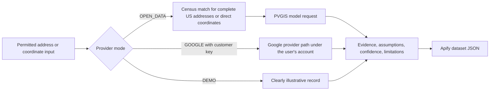

> **Live API:** [Run Solar Panel Rooftop Lead Scorer on Apify](https://apify.com/kamerozkan/solar-rooftop-lead-scorer)

# Solar Rooftop Lead Scorer: Samples and JSON Schema

[](https://apify.com/kamerozkan/solar-rooftop-lead-scorer)


Turn permitted property locations into explainable solar pre-screen records with provider labels, explicit evidence, model ranges, confidence fields, and fail-closed outcomes.

This repository contains three schema-valid inputs, two privacy-minimized live provider result projections, one actual illustrative demo result, and the sample record contract in [`dataset_record.schema.json`](dataset_record.schema.json).

> **Decision boundary:** These are automated screening records, not rooftop suitability, current imagery, a panel layout, realized production or savings, engineering approval, a permit, or a binding quote.

## Start here

1. Open the [Actor on Apify](https://apify.com/kamerozkan/solar-rooftop-lead-scorer).
2. Use input 03 for a no-Google-key coordinate pre-screen, or input 01 to inspect the illustrative demo shape.
3. Keep the first run small and set a maximum cost in Apify.
4. Retain provider attribution, assumptions, limitations, and the site-survey flag.

`OPEN_DATA` mode does not require a Google API key. Calling Apify through its API still requires Apify authentication. Google BYOK mode is available in the Actor but is not represented by the output samples in this repository.

At the 2026-07-29 audit, the Actor was public and latest build `0.2.10` had completed successfully. The two inspected live rows used build `0.2.6`; the public demo task's inspected run used build `0.1.11`. The repository does not claim runtime validation of `0.2.10`.

## What the contract makes explicit

| Decision question | Unstructured lead row | This sample contract |
|---|---|---|
| Which path produced the row? | Often unstated | `providerMode`, source names, URLs, and attribution |
| Was a property matched? | Missing value can be ambiguous | Explicit `qualified`, `no_data`, or `error` status |
| What capacity was assessed? | May look measured | `assessmentScope`, `capacitySource`, and scenario fields |
| How strong is the evidence? | One blended score | Separate lead score, confidence, and completeness fields |
| What was not measured? | Often omitted | Limitations and `requiresSiteSurvey` |
| Was the row only a demo? | Can look real | `providerMode: "DEMO"`, `demoMode: true`, and demo reason code |

## Input examples

<details>
<summary><strong>01. Public Apify Example Task</strong> - exact illustrative demo input</summary>

[`01_public_demo_example_task_input.json`](01_public_demo_example_task_input.json)

```json
{
  "acceptTerms": true,
  "addresses": [
    "1600 Amphitheatre Parkway, Mountain View, CA 94043"
  ],
  "demoMode": true
}
```

This is the exact input of the sole public Example Task at audit time. Demo mode makes no real property or live provider assessment.

</details>

<details>
<summary><strong>02. Verified two-address OPEN_DATA run</strong> - exact successful-run configuration</summary>

[`02_verified_open_data_address_run_input.json`](02_verified_open_data_address_run_input.json)

```json
{
  "acceptTerms": true,
  "demoMode": false,
  "addressItems": [
    {
      "address": "1 Apple Park Way, Cupertino, CA 95014",
      "roofAreaM2": 800
    },
    {
      "address": "350 5th Ave, New York, NY 10118",
      "systemCapacityKw": 25
    }
  ],
  "countryCode": "US",
  "requiredQuality": "BASE",
  "defaultSystemCapacityKw": 5,
  "usableRoofFraction": 0.55,
  "panelPowerWatts": 440,
  "panelAreaM2": 2,
  "systemLossPercent": 14,
  "pvgisMountingPlace": "free",
  "pvgisPvTechnology": "crystSi2025",
  "energyUncertaintyPercent": 20,
  "minLeadScore": 65,
  "incentiveRate": 0,
  "maxItems": 1000,
  "concurrency": 5,
  "requestTimeoutSecs": 30
}
```

The inputs are public corporate or landmark addresses, not private residences. This run used open-data mode because it supplied no Google key.

</details>

<details>
<summary><strong>03. Berlin coordinate quick start</strong> - current Store recipe</summary>

[`03_public_berlin_coordinate_recipe_input.json`](03_public_berlin_coordinate_recipe_input.json)

```json
{
  "providerMode": "OPEN_DATA",
  "acceptTerms": true,
  "coordinates": [
    {
      "id": "berlin-sample",
      "latitude": 52.52,
      "longitude": 13.405,
      "roofAreaM2": 100
    }
  ]
}
```

The coordinate is the public city-level quick-start value from the Actor README. `roofAreaM2` is a supplied scenario input, not an Actor measurement.

</details>

## Output examples

Outputs 01 and 02 are field-level projections from the same successful live run. Output 03 is an actual Actor result from the public Example Task, but every value in it is illustrative. See [`DATA_NOTICE.md`](DATA_NOTICE.md) for run IDs, dataset IDs, version boundaries, and minimization details.

<details>
<summary><strong>01. Failed-closed address match</strong> - no estimates invented</summary>

[`01_live_no_geocode_match_output.json`](01_live_no_geocode_match_output.json)

```json
{
  "sourceId": "address-item-1",
  "source": "addressItems",
  "providerMode": "OPEN_DATA",
  "demoMode": false,
  "inputAddress": "1 Apple Park Way, Cupertino, CA 95014",
  "formattedAddress": null,
  "latitude": null,
  "longitude": null,
  "status": "no_data",
  "leadScore": null,
  "qualified": null,
  "scenarioPanels": null,
  "scenarioSystemCapacityKw": null,
  "specificYieldKwhPerKwp": null,
  "estimatedAnnualEnergyKwhAc": null,
  "estimatedAnnualEnergyKwhAcLow": null,
  "estimatedAnnualEnergyKwhAcHigh": null,
  "requiresSiteSurvey": true,
  "assumptions": [],
  "limitations": [],
  "reasonCodes": [
    "NO_GEOCODE_MATCH"
  ],
  "explanation": [
    "The U.S. Census Geocoder found no matching address."
  ],
  "error": {
    "code": "NO_GEOCODE_MATCH",
    "message": "The U.S. Census Geocoder found no matching address.",
    "retryable": false,
    "httpStatus": null,
    "details": null
  },
  "googleMapsAttribution": null,
  "solarDataAttribution": "European Commission Joint Research Centre - PVGIS 5.3",
  "derivedContentAttribution": "Derived by Solar Rooftop Lead Scorer from PVGIS and user assumptions.",
  "googleContentExpiresAt": null,
  "dataSource": {
    "geocoding": "U.S. Census Geocoder Public_AR_Current",
    "solarResource": "European Commission JRC PVGIS 5.3",
    "rooftopGeometry": "Not measured"
  },
  "dataSourceUrls": {
    "geocoding": "https://geocoding.geo.census.gov/geocoder/",
    "solarResource": "https://re.jrc.ec.europa.eu/pvg_tools/en/"
  },
  "processedAt": "2026-07-28T14:52:39.914Z"
}
```

`no_data` is not `not_qualified`. It means no accepted address match was available for the configured path.

</details>

<details>
<summary><strong>02. Qualified OPEN_DATA pre-screen</strong> - user-supplied 25 kW scenario</summary>

[`02_live_open_data_qualified_output.json`](02_live_open_data_qualified_output.json)

```json
{
  "sourceId": "address-item-2",
  "source": "addressItems",
  "providerMode": "OPEN_DATA",
  "demoMode": false,
  "inputAddress": "350 5th Ave, New York, NY 10118",
  "formattedAddress": "350 5TH AVE NEW YORK NY 10118",
  "latitude": 40.747848600317,
  "longitude": -73.985077152891,
  "geocodingPlaceId": "US_CENSUS_TIGER:59653473",
  "geocodingLocationType": "TIGER_ADDRESS_RANGE_INTERPOLATION",
  "geocodingConfidenceLevel": "medium",
  "regionCode": "US",
  "administrativeAreaCode": "NY",
  "postalCode": "10118",
  "status": "qualified",
  "leadScore": 91,
  "qualified": true,
  "scenarioPanels": 57,
  "scenarioSystemCapacityKw": 25,
  "specificYieldKwhPerKwp": 1466,
  "annualIrradiationKwhM2": 1794,
  "estimatedAnnualEnergyKwhAc": 36644,
  "estimatedAnnualEnergyKwhAcLow": 29315,
  "estimatedAnnualEnergyKwhAcHigh": 43972,
  "estimatedAnnualSavingsUsd": null,
  "simplePaybackYears": null,
  "grossAnnualEnergyValueUsd": null,
  "grossValueSimplePaybackYears": null,
  "assessmentScope": "user_system_capacity",
  "capacitySource": "item_system_capacity",
  "openDataConfidence": "low",
  "assessmentConfidenceScore": null,
  "evidenceCompletenessScore": 50,
  "requiresSiteSurvey": true,
  "pvgisPanelTiltDegrees": 38,
  "pvgisPanelAzimuthDegrees": -5,
  "pvgisAnnualVariabilityKwhPerKwp": 38.6,
  "pvgisTotalLossPercent": 18.3,
  "pvgisMountingType": "free-standing",
  "pvgisMountingPlace": "free",
  "pvgisPvTechnology": "crystSi2025",
  "radiationDatabase": "PVGIS-ERA5",
  "meteorologicalDatabase": "ERA5",
  "dataYearStart": 2005,
  "dataYearEnd": 2023,
  "horizonSource": "DEM-calculated",
  "limitations": [
    "No roof-plane geometry, obstructions, nearby tree/building shade, structural condition, or panel layout was measured.",
    "PVGIS models regional solar resource and terrain horizon; it does not model parcel-level rooftop shading.",
    "Verify the address match, roof dimensions, orientation, electrical connection, permits, tariff, and economics before a quote."
  ],
  "reasonCodes": [
    "STRONG_OPEN_SOLAR_RESOURCE",
    "USER_SUPPLIED_SYSTEM_CAPACITY",
    "QUALIFIED_PRE_SCREEN"
  ],
  "explanation": [
    "1466 kWh/kWp annual PVGIS yield supports strong production.",
    "Open-data pre-screen score 91 meets the 65 threshold."
  ],
  "googleMapsAttribution": null,
  "solarDataAttribution": "European Commission Joint Research Centre - PVGIS 5.3",
  "derivedContentAttribution": "Derived by Solar Rooftop Lead Scorer from PVGIS and user assumptions.",
  "googleContentExpiresAt": null,
  "dataSource": {
    "geocoding": "U.S. Census Geocoder Public_AR_Current",
    "solarResource": "European Commission JRC PVGIS 5.3",
    "rooftopGeometry": "Not measured"
  },
  "dataSourceUrls": {
    "geocoding": "https://geocoding.geo.census.gov/geocoder/",
    "solarResource": "https://re.jrc.ec.europa.eu/pvg_tools/en/"
  },
  "processedAt": "2026-07-28T14:52:39.915Z"
}
```

The 25 kW capacity was supplied in the input. Neither the capacity nor the panel-equivalent count was measured from rooftop imagery.

</details>

<details>
<summary><strong>03. Actual illustrative demo row</strong> - output shape only</summary>

[`03_actual_illustrative_demo_output.json`](03_actual_illustrative_demo_output.json)

```json
{
  "sourceId": "demo-property-001",
  "source": "illustrative_demo",
  "providerMode": "DEMO",
  "demoMode": true,
  "inputAddress": "Illustrative residential property",
  "formattedAddress": "Illustrative demo property, not a real address",
  "status": "qualified",
  "leadScore": 82,
  "qualified": true,
  "maxPanels": 28,
  "recommendedPanels": 18,
  "maxSystemCapacityKw": 11.2,
  "estimatedAnnualEnergyKwhAc": 9800,
  "estimatedAnnualEnergyKwhDc": 10600,
  "estimatedAnnualSavingsUsd": 2058,
  "simplePaybackYears": 7.4,
  "savingsYear20Amount": 31600,
  "financialCurrencyCode": "USD",
  "financialDataSource": "ILLUSTRATIVE_DEMO",
  "usableArrayAreaM2": 61.4,
  "maxSunshineHoursPerYear": 1580,
  "imageryDate": null,
  "reasonCodes": [
    "DEMO_DATA",
    "STRONG_SOLAR_POTENTIAL",
    "ATTRACTIVE_PAYBACK"
  ],
  "processedAt": "2026-07-28T12:53:53.153Z",
  "googleContentExpiresAt": "2026-07-28T12:53:53.153Z"
}
```

This row proves the public task's output shape only. It is not a real property, live provider response, current imagery record, savings estimate, or qualified lead.

</details>

## Pipeline



Provider coverage and availability can change. The diagram describes data flow, not a guarantee that any address or coordinate will return a result.

## Validate a sample

```javascript
import Ajv2020 from "ajv/dist/2020.js";
import addFormats from "ajv-formats";
import schema from "./dataset_record.schema.json" with { type: "json" };
import row from "./02_live_open_data_qualified_output.json" with { type: "json" };

const ajv = new Ajv2020({ allErrors: true });
addFormats(ajv);
if (!ajv.validate(schema, row)) throw new Error(ajv.errorsText());
```

## API example

```bash
curl -X POST \
  "https://api.apify.com/v2/acts/kamerozkan~solar-rooftop-lead-scorer/run-sync-get-dataset-items?token=$APIFY_TOKEN" \
  -H "Content-Type: application/json" \
  -d @03_public_berlin_coordinate_recipe_input.json
```

Never commit an Apify token or a Google API key. Review current pricing and set a maximum run charge before increasing the workload.

## Scope and legal boundary

This independent sample is not affiliated with, endorsed by, or sponsored by Google, the European Commission, the U.S. Census Bureau, a utility, installer, property owner, or address represented here.

No coverage, current imagery, rooftop suitability, accuracy, completeness, freshness, real-time behavior, production, savings, installation outcome, uptime, or service-level guarantee is provided. Review the current Actor terms, provider conditions, privacy and marketing rules, and [`DATA_NOTICE.md`](DATA_NOTICE.md) before production use.

## License

Repository text, examples, and schema are available under the [MIT License](LICENSE). Third-party names, provider data, and source material remain subject to their respective rights and terms.
